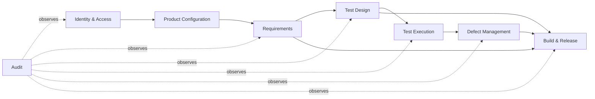
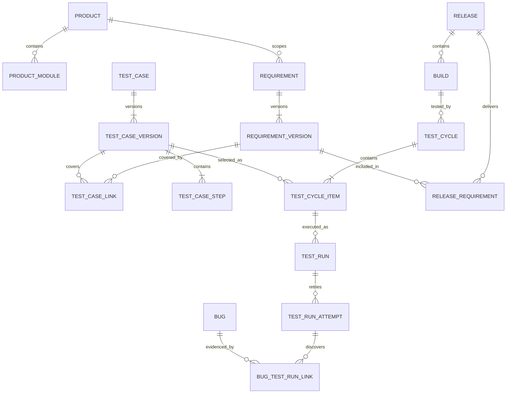

# Conceptual Domain Model — Proposed

เอกสารนี้กำหนดความหมายและ ownership ของข้อมูลก่อนออกแบบ physical schema รายละเอียด column/index จะทำหลังเลือก database engine

## Context Map

## Core Relationships

## Aggregate Ownership

| Aggregate | Root | Child/value objects | Important invariant |
|---|---|---|---|
| Product Configuration | Product | Module, Environment | Code unique; inactive master ห้ามใช้กับรายการใหม่ |
| Requirement | Requirement | Version, acceptance criterion, link | Published version immutable |
| Test Design | TestCase | Version, Step, tag, source link | Approved version immutable และมี expected result |
| Test Cycle | TestCycle | CycleItem, assignment | CycleItem pin TestCaseVersion |
| Test Execution | TestRun | Attempt, result, evidence | Failed/Blocked ต้องมี actual/evidence |
| Defect | Bug | Status history, links, comment | Fixed ต้องมี fix build; duplicate ต้องมี canonical bug |
| Release | Release | Build, checklist, sign-off | Sign-off ต้องอ้าง snapshot ของ gate inputs |

## Identity and Tenant Scope

- MVP เป็นระบบองค์กรเดียว แต่ทุก business entity ต้องมี `productId`
- Entity ที่ละเอียดระดับ module ใช้ `moduleId` แบบ nullable เฉพาะกรณีที่เป็น product-wide จริง
- Permission query ต้องใช้ effective product/module scopes จาก server-side identity
- ห้ามรับ actor/user ID จาก request body เพื่อใช้เป็นผู้แก้ไข ให้ใช้ authenticated principal

## Versioning Rules

- `Requirement` และ `TestCase` เป็น stable identity
- `RequirementVersion` และ `TestCaseVersion` เก็บ content snapshot
- Version number เพิ่มแบบ server-controlled และ unique ต่อ stable identity
- Draft แก้ไขได้ตาม optimistic concurrency; Published แก้ไม่ได้
- Link สำหรับ release/cycle ต้อง pin version ไม่ชี้เพียง stable identity

## Common Metadata

สำหรับ mutable records:

- `createdAtUtc`, `createdBy`
- `updatedAtUtc`, `updatedBy`
- concurrency token (`rowVersion` หรือ equivalent)
- lifecycle status

`AuditEvent` เก็บแยกต่างหากและ append-only ห้ามใช้ metadata สี่ช่องแทน audit history

## Deletion and Retention

- Master/working record ที่ยังไม่มี downstream link อาจ archive/soft delete ตาม policy
- Published/versioned/transaction record ห้าม hard delete ผ่าน application workflow
- Attachment binary และ metadata ใช้ retention/classification policy เดียวกัน
- คำขอลบข้อมูลต้องสร้าง auditable administrative workflow

## Open Questions

1. Requirement หนึ่งรายการข้ามหลาย Product ได้หรือบังคับแยกราย Product?
2. Test Case reuse ข้าม Product/Module อนุญาตระดับใด?
3. Bug system เป็น source of truth หรือ sync กับ issue tracker ภายนอก?
4. Release ประกอบหลาย Product ได้หรือไม่?
5. Attachment retention และ maximum file size เท่าใด?

